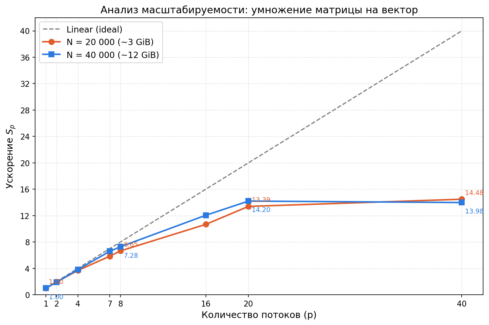

# Task 3 — Задание 1: Многопоточное умножение матрицы на вектор

Реализация многопоточного умножения матрицы на вектор .

## Сборка

```bash
mkdir build && cd build
cmake .. -DCMAKE_BUILD_TYPE=Release
make -j
./task3_1
```

## Описание реализации

- Декомпозиция по строкам: каждый поток обрабатывает свой диапазон строк матрицы
- Параллельная инициализация массивов для корректного распределения памяти по NUMA-узлам (first-touch policy)
- Автоматическая синхронизация через деструктор `std::jthread`

## Результаты

Сервер: **80 ядер**, **754 GiB RAM**, GCC 11.4.0 `-O2`, среднее по 5 итерациям.

### N = 20 000 (матрица ~3 GiB)

| Потоки (p) | T (с)  | Ускорение S_p | Эффективность E_p |
| :--------: | :----: | :-----------: | :---------------: |
|     1      | 0.6186 |     1.00      |       1.000       |
|     2      | 0.3193 |     1.94      |       0.969       |
|     4      | 0.1679 |     3.68      |       0.921       |
|     7      | 0.1057 |     5.85      |       0.836       |
|     8      | 0.0930 |     6.65      |       0.832       |
|     16     | 0.0580 |     10.67     |       0.667       |
|     20     | 0.0462 |     13.39     |       0.670       |
|     40     | 0.0427 |     14.48     |       0.362       |

### N = 40 000 (матрица ~12 GiB)

| Потоки (p) | T (с)  | Ускорение S_p | Эффективность E_p |
| :--------: | :----: | :-----------: | :---------------: |
|     1      | 2.4537 |     1.00      |       1.000       |
|     2      | 1.2964 |     1.89      |       0.946       |
|     4      | 0.6425 |     3.82      |       0.955       |
|     7      | 0.3724 |     6.59      |       0.941       |
|     8      | 0.3371 |     7.28      |       0.910       |
|     16     | 0.2037 |     12.05     |       0.753       |
|     20     | 0.1727 |     14.20     |       0.710       |
|     40     | 0.1755 |     13.98     |       0.350       |

### График ускорения



## Вывод о масштабируемости

Программа показывает **хорошую масштабируемость до 8–16 потоков**.

После 20 потоков прирост незначителен — задача является **memory-bound**.

При 40 потоках для N=40000 ускорение даже незначительно падает (14.20 → 13.98) по сравнению с 20 потоками: шина памяти уже насыщена, а накладные расходы вносят дополнительные потери.
